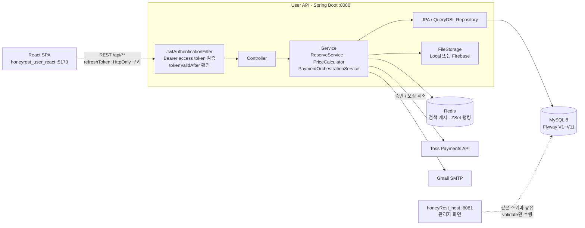

# HoneyRest – 숙소 예약 플랫폼 · User API

[](https://github.com/Seongwonp/honeyRest_user/actions/workflows/ci.yml)


**HoneyRest**는 숙소 검색 → 객실 선택 → 쿠폰·포인트 적용 → 토스 결제 → 리뷰까지 이어지는 숙소 예약 플랫폼입니다.
이 저장소는 사용자(React SPA)가 호출하는 **REST API 서버**로, 인증(JWT + OAuth2), 숙소 검색, 예약·재고, 결제, 리뷰, 마이페이지를 담당하고
**공유 DB 스키마(Flyway V1~V11)의 소유자**입니다. 4주 팀 프로젝트(2025.08) 이후 예약 동시성, 결제 보상, 권한 경계, 테스트·CI를 단독으로 보강했습니다.

| 저장소 | 역할 |
|--------|------|
| **honeyRest_user** (현재) | 사용자 REST API · Spring Boot · 스키마(Flyway) 소유 |
| [honeyrest_user_react](https://github.com/Seongwonp/honeyrest_user_react) | 사용자 화면 · React 19 SPA |
| [honeyRest_host](https://github.com/Seongwonp/honeyRest_host) | 업체 관리자 / 총관리자 화면 · Spring Boot + Thymeleaf |

---

## 역할

**팀 프로젝트 (2025.08.04 ~ 2025.09.04, 4주, 3명)**

| 이름 | 담당 |
|------|------|
| 박성원 (팀장) | 사용자(User) 영역 개발 총괄(API + React) & 광고 영상 제작 / 전체 DB 설계 및 ERD 작성 / 관리자 시스템 기술 방향 결정(Thymeleaf) / 전체 시스템 통합 및 코드 리뷰 / 발표 자료 기획·디자인 |
| 김민경 | 업체 관리자(Company Admin) 시스템 개발 |
| 설현오 | 총 관리자(Super Admin) 시스템 개발 |

**프로젝트 종료 후 단독 고도화 (2025.09 ~ , 박성원)**

- **보안 경계**: 요청 본문의 `userId` 대신 인증 주체로 소유권 판단(IDOR 차단), 관리자 쓰기 API 역할 제한, 민감정보 로그 제거 → [API 권한 매트릭스](docs/API_PERMISSION_MATRIX.md)
- **토큰 폐기**: 로그아웃·비밀번호 변경 시 이전에 발급된 access token 즉시 무효화(`tokenValidAfter`, Flyway V9)
- **예약 재고**: 객실 행 비관적 락 + 기간 겹침 카운트로 초과 예약 차단, 예약 상태 상수를 관리자 저장소와 통일
- **결제 일관성**: 사전 검증 → 토스 승인 → 락 트랜잭션 저장 → 실패 시 자동 결제 취소(보상)
- **가격 계산 단일화**: `price_calendar` 기반 `PriceCalculator` 하나로 화면 금액과 결제 검증 금액 일치
- **운영 기반**: 파일 저장소 추상화(로컬/Firebase), 미사용 의존성 제거, H2 테스트 프로필 + GitHub Actions CI
- 상세 기록: [IMPROVEMENTS.md](docs/IMPROVEMENTS.md) · [STABILIZATION.md](docs/STABILIZATION.md)

---

## 기술 스택

| 구분 | 기술 |
|------|------|
| Language / Framework | Java 17, Spring Boot 3.5.4 (Web, Validation, Actuator) |
| 인증 / 인가 | Spring Security, JJWT 0.11.5 (access token), HttpOnly refresh token 쿠키, OAuth2 소셜 로그인 (Google, Kakao) |
| 데이터 | MySQL 8, Spring Data JPA, QueryDSL 5.0, Flyway (V1~V11, `ddl-auto=validate`) |
| 캐시 | Redis (Spring Data Redis: 검색 결과 캐시, ZSet 인기 지역 랭킹, 리뷰 좋아요 카운터), Spring Cache |
| 결제 | Toss Payments 결제 승인·취소 API (`RestTemplate`) |
| 파일 저장 | `FileStorage` 추상화 — 로컬 디스크(기본) / Firebase Storage(선택), Thumbnailator |
| 메일 | Spring Mail (Gmail SMTP, `@Async` 발송) |
| 문서 / 로깅 | SpringDoc OpenAPI 2.2 (Swagger UI), Log4j2 |
| 테스트 / CI | JUnit 5, Mockito, Spring Security Test, H2 (MySQL 모드), GitHub Actions |

---

## 아키텍처



- 사용자 API와 관리자 앱은 **하나의 MySQL 스키마를 공유**합니다. 스키마 변경은 이 저장소의 Flyway 마이그레이션으로만 하고, 관리자 앱은 `ddl-auto=validate`로 매핑 정합성만 확인합니다.
- 도메인·ERD: [ARCHITECTURE.md](docs/ARCHITECTURE.md) · 컬럼 명세: [DB_SCHEMA.md](DB_SCHEMA.md) · 기능 목록: [FEATURES.md](docs/FEATURES.md)

---

## 핵심 설계 결정 & 트러블슈팅

### 1. 결제는 승인됐는데 예약 저장이 실패하는 문제 — 보상 트랜잭션
- **문제**: 토스 승인(외부 과금)과 예약 INSERT(내부 DB)는 하나의 트랜잭션으로 묶을 수 없어, 승인 후 DB 오류·매진 시 "돈은 빠졌는데 예약은 없는" 상태가 생길 수 있었습니다.
- **결정**: ① 과금 전 사전 검증(중복 `paymentKey`·예약번호, 주문번호, **서버 재계산 금액**, 재고) → ② 토스 승인 → ③ `TransactionTemplate` 안에서 객실 락 + 재고 재확인 후 저장 → ④ ③ 실패 시 `TossService.cancelPayment`로 자동 취소. 같은 `paymentKey`가 동시 요청으로 이미 저장됐다면 정상 결제이므로 취소하지 않고, 취소마저 실패하면 `orderId`와 함께 수동 환불 로그를 남깁니다.
- **결과**: 승인 후 실패·매진·중복 요청 시나리오 7건을 단위 테스트로 고정. 예약번호 `UNIQUE` 제약이 최종 멱등성 방어선입니다.
- 코드: [`PaymentOrchestrationService`](src/main/java/com/honeyrest/honeyrest_user/service/payment/PaymentOrchestrationService.java) · [테스트](src/test/java/com/honeyrest/honeyrest_user/service/payment/PaymentOrchestrationServiceTest.java)

### 2. 마지막 1실 동시 예약 — 비관적 락 + 기간 겹침 카운트
- **문제**: 예약 시 재고 검사가 없어 같은 객실·기간에 `total_rooms`를 초과하는 예약이 저장될 수 있었습니다.
- **결정**: 재고 = `room.total_rooms − [체크인, 체크아웃)과 겹치는 점유 상태 예약 수`. 저장 직전 `RoomRepository.findByIdForUpdate`(`PESSIMISTIC_WRITE`)로 객실 행을 잠그고 `ReservationRepository.countOverlapping`으로 재확인, 부족하면 409. 공유 스키마에 `version` 컬럼이 없어 낙관적 락 대신 행 락을 택했고, 관리자 화면이 쓰는 스냅샷 값 `price_calendar.available_room`은 판정에 쓰지 않습니다.
- **결과**: 같은 객실의 예약 트랜잭션이 직렬화되고, 관리자 저장소도 동일 규칙(`ReservationInventoryGuard`)을 적용해 두 앱이 같은 재고 기준을 사용합니다.
- 코드: [`ReserveService`](src/main/java/com/honeyrest/honeyrest_user/service/reservation/ReserveService.java) · [`ReservationRepository`](src/main/java/com/honeyrest/honeyrest_user/repository/reservation/ReservationRepository.java) · [`ReservationStatus`](src/main/java/com/honeyrest/honeyrest_user/entity/ReservationStatus.java)

### 3. 화면 금액과 결제 금액 불일치 — 가격 계산기 단일화
- **문제**: 예약 폼과 결제 검증이 각자 금액을 계산해 날짜별 요금(`price_calendar`)·추가 인원 요금 반영 여부가 달랐고, 클라이언트가 보낸 금액을 그대로 믿는 경로도 있었습니다.
- **결정**: 1박 요금(`price_calendar` 우선, 없으면 기본가), 과금 일자(체크아웃 당일 제외), 추가 인원 요금 규칙을 `PriceCalculator` 한 곳에 두고 예약 폼 조회와 결제 검증이 모두 이를 호출. 쿠폰·포인트도 서버에서 소유자·기간·최소 금액을 재검증합니다.
- **결과**: 화면 표시 금액 = 예약 저장 금액 = 토스 요청 금액. 금액이 다르면 토스 호출 전에 거절됩니다.
- 코드: [`PriceCalculator`](src/main/java/com/honeyrest/honeyrest_user/service/reservation/PriceCalculator.java) · [테스트](src/test/java/com/honeyrest/honeyrest_user/service/reservation/PriceCalculatorTest.java)

### 4. 로그아웃 후에도 살아 있는 access token — `tokenValidAfter`
- **문제**: 무상태 JWT라 로그아웃·비밀번호 변경 후에도 기존 access token이 만료 시각까지 유효했습니다.
- **결정**: refresh token은 HttpOnly·SameSite 쿠키로만 전달하고(DB 저장, 로그아웃 시 삭제), `user.token_valid_after` 컬럼(Flyway V9)을 추가해 로그아웃·비밀번호 변경 시 갱신. 인증 필터가 이미 조회하는 사용자 행에서 `iat < tokenValidAfter`이면 거부하므로 Redis 블랙리스트 같은 추가 저장소가 필요 없습니다.
- **결과**: 폐기 즉시 기존 토큰이 401. JWT `iat`가 초 단위인 점을 고려해 `tokenValidAfter`를 "폐기 시각 초 내림 + 1초"로 저장하고, 새 토큰은 `iat = max(now, tokenValidAfter)`로 발급합니다. 비교도 epoch 초 단위(`iat < tokenValidAfter` → 거부)라서 **폐기 직전(같은 초 포함) 토큰은 항상 거부, 로그아웃 직후 같은 초의 재로그인 토큰은 항상 허용**으로 결정적으로 동작합니다. 대가로 폐기 직후 발급 토큰의 `iat`/만료가 최대 1초 뒤로 밀립니다.
- 코드: [`JwtTokenProvider`](src/main/java/com/honeyrest/honeyrest_user/security/JwtTokenProvider.java) · [`RefreshTokenCookieManager`](src/main/java/com/honeyrest/honeyrest_user/util/RefreshTokenCookieManager.java) · [`V9`](src/main/resources/db/migration/V9__add_user_token_valid_after.sql)

### 5. 숙소 검색 — N+1 회피 조회 구조와 Redis 캐시 키 정합성
- **문제**: 검색 결과마다 객실 재고·태그를 붙여야 해 엔티티 연관을 따라가면 N+1이 되기 쉬운 화면입니다. 또 기존 Redis 캐시 키에 날짜·인원·사용자·최대가격이 빠져 예약 가능 여부·찜 상태가 다른 요청이 같은 캐시를 공유했고, 현재 페이지 목록 크기를 전체 건수로 써서 숙소 33개가 20개·1페이지로 축소되는 버그가 있었습니다.
- **결정**: 숙소 목록은 QueryDSL `Projections.constructor`로 DTO를 한 번에 조회(평점·리뷰 수·찜 여부 집계 포함)하고, 예약 수·객실·태그는 숙소 ID `IN` 조회 3회로 묶어 메모리에서 매핑. 태그 필터는 `groupBy + having countDistinct` 서브쿼리. 캐시 키는 위치·좌표·날짜·인원·사용자·정렬·카테고리/태그(정렬)·가격·페이지를 정규화해 `search:recommend:v2` 접두사로 구성하고, 전체 건수도 별도 키로 저장(TTL 6시간)해 둘 다 있을 때만 적중으로 인정합니다.
- **결과**: 페이지 크기와 무관하게 쿼리 수가 일정하고, 캐시 적중 시에도 페이지 정보가 보존됩니다. 캐시 키 규칙은 단위 테스트로 고정했습니다.
- 코드: [`AccommodationSearchImpl`](src/main/java/com/honeyrest/honeyrest_user/repository/accommodation/AccommodationSearchImpl.java) · [캐시 키 테스트](src/test/java/com/honeyrest/honeyrest_user/repository/accommodation/AccommodationSearchCacheKeyTest.java) · ZSet 인기 지역·인기 숙소 랭킹: [`RegionService`](src/main/java/com/honeyrest/honeyrest_user/service/RegionService.java), [`AccommodationService`](src/main/java/com/honeyrest/honeyrest_user/service/accommodation/AccommodationService.java)

### 6. 두 앱이 공유하는 스키마 — Flyway 소유권과 상태 값 통일
- **문제**: 관리자 앱이 `ddl-auto=validate`로 기동하는데, 관리자 엔티티에만 있는 컬럼(`reservation.accommodation_name`)과 저장소마다 다른 상태 철자(`CANCELED`/`CANCELLED`)로 기동 실패·취소 집계 0건 같은 문제가 생겼습니다.
- **결정**: 스키마 변경은 이 저장소 Flyway에서만 하고(이미 적용된 파일은 수정하지 않고 교정 마이그레이션 추가), V10으로 관리자 매핑에 맞춘 컬럼을, V11로 관리자 전용 `error_log` 테이블과 구세대 NOT NULL 컬럼 완화를 추가. 예약 상태·재고 점유 상태 목록은 `ReservationStatus` 상수로 두 저장소에 동일하게 정의했습니다.
- **결과**: 두 저장소 모두 `integrationTest`(Testcontainers MySQL 8.0)로 "Flyway로 새로 만든 DB에서 스키마 검증 통과"를 CI에서 자동 확인합니다. 차이 목록은 [DB_SCHEMA.md §6](DB_SCHEMA.md) 참고.
- 코드: [`db/migration`](src/main/resources/db/migration) · [`V10`](src/main/resources/db/migration/V10__add_reservation_accommodation_name.sql) · [`V11`](src/main/resources/db/migration/V11__host_schema_alignment.sql)

### 7. Firebase 키 없이는 실행조차 안 되던 구조 — `FileStorage` 추상화
- **문제**: 업로드가 Firebase SDK에 직접 묶여 있어 서비스 계정 키가 없으면 앱과 테스트가 기동되지 않았습니다.
- **결정**: `FileStorage` 인터페이스에 `LocalFileStorage`(기본)와 `FirebaseFileStorage`를 두고 `@ConditionalOnProperty(app.storage.type)`으로 선택. 폴더명은 정규식으로 검증해 경로 조작을 막고, 삭제는 지정 폴더 하위 URL만 허용합니다.
- **결과**: 외부 키 없이 로컬 실행·CI가 가능해졌고, 기존 Firebase URL은 시드 스크립트로 로컬 플레이스홀더로 바꿀 수 있습니다.
- 코드: [`storage/`](src/main/java/com/honeyrest/honeyrest_user/storage) · [`LocalFileStorageTest`](src/test/java/com/honeyrest/honeyrest_user/storage/LocalFileStorageTest.java)

---

## 실행 방법

**필요 환경**: JDK 17, MySQL 8, Redis (기본 포트 6379)

1. **시크릿 파일**: `src/main/resources/application_security_ex.properties`를 복사해 같은 폴더에 `application_security.properties`를 만들고 값을 채웁니다(gitignore 대상).
   DB 비밀번호, `jwt.secret-key-value`, Toss 위젯 키, Google/Kakao OAuth, Gmail, OpenWeather 키가 들어갑니다.
2. **파일 저장소**: 기본값 `app.storage.type=local`(업로드는 `./uploads`, `/uploads/**`로 서빙) — Firebase 키가 필요 없습니다.

   | 환경변수 | 프로퍼티 | 기본값 |
   |----------|----------|--------|
   | `APP_STORAGE_TYPE` | `app.storage.type` | `local` (`firebase` 선택 가능) |
   | `APP_STORAGE_LOCAL_DIR` | `app.storage.local.dir` | `./uploads` |
   | `FIREBASE_STORAGE_BUCKET` / `FIREBASE_PROJECT_ID` | `app.storage.firebase.*` | firebase 모드에서만 사용 |

3. **실행**: 기동 시 Flyway가 `honeyrest_db`에 V1~V11을 적용합니다.
   ```bash
   ./gradlew bootRun                                            # http://localhost:8080
   ./gradlew bootRun --args='--spring.profiles.active=local'    # SQL 로그 출력
   ```
4. **데이터 시드** (권장 순서)
   - 기초 데이터(지역·카테고리·업체·숙소·객실): 관리자 저장소의 [`db/seed/`](https://github.com/Seongwonp/honeyRest_host/tree/main/db/seed) SQL (`insert.sql` → `insert_pk_1-20.sql` → `insert_pk_21-30.sql` → `insert_pk_31-33.sql`)
   - 데모 리뷰 사용자·리뷰: [`scripts/seed-demo-data.sql`](scripts/seed-demo-data.sql) (반복 실행 안전)
   - 로컬 저장소 모드 이미지: [`scripts/seed-local-images.sql`](scripts/seed-local-images.sql) (Firebase URL → `/uploads/placeholder/*.svg`)
5. **포트 / 연동**: User API `8080` · 관리자 앱 `8081` · React 개발 서버 `5173`(`/api`, `/uploads`를 8080으로 프록시)
6. **데모 계정**: 사용자는 회원가입으로 생성합니다. 관리자 계정은 관리자 저장소를 `local-demo` 프로필로 실행하면 [`DataInitializer`](https://github.com/Seongwonp/honeyRest_host/blob/main/src/main/java/com/honeyrest/honeyrest_host/config/DataInitializer.java)가 생성하며, 계정 정보는 해당 파일에 정의되어 있습니다.

Swagger UI: `http://localhost:8080/swagger-ui.html` · 상세 설정: [SETUP.md](docs/SETUP.md)

---

## 테스트 & CI

```bash
./gradlew test               # MySQL·Redis·시크릿 파일 없이 실행 (H2)
./gradlew build              # CI 1단계와 동일
./gradlew integrationTest    # Docker 필요: 실제 MySQL 8.0 으로 마이그레이션·스키마 검증 (CI 2단계)
```

- **85개 테스트** — 결제 보상(`PaymentOrchestrationServiceTest`), 재고 겹침(`ReserveServiceTest`), 가격 계산(`PriceCalculatorTest`), 토큰 폐기(`JwtTokenProviderTest`), 관리자 쓰기 API 인가(`AdminWriteApiSecurityTest`), 검색 캐시 키, 로컬 파일 저장소 등
- **test 프로필**: H2 인메모리(MySQL 모드) + 더미 시크릿 + `app.storage.type=local` + `spring.cache.type=simple` → 외부 서비스 없이 어디서든 동일하게 동작하고 개발 DB를 건드리지 않습니다.
- **트레이드오프**: V3·V10 등 일부 마이그레이션이 MySQL 전용 구문(`information_schema` 조회 + `PREPARE`)을 써서 테스트에서는 Flyway를 끄고 엔티티로 스키마를 생성(`create-drop`)합니다. 마이그레이션 SQL 자체는 아래 스키마 통합 테스트가 따로 검증합니다. 동시성 역시 락 호출·겹침 판정을 단위 테스트로 검증했고, 실제 병렬 부하 테스트는 아직 없습니다.
- **스키마 통합 테스트** (`@Tag("integration")`, 기본 `test`에서는 제외): [`FlywayMigrationMySqlIntegrationTest`](src/test/java/com/honeyrest/honeyrest_user/schema/FlywayMigrationMySqlIntegrationTest.java)가 Testcontainers로 `mysql:8.0`을 띄워 빈 DB에 V1~최신을 적용하고, ① 모든 마이그레이션 성공 ② `reservation.accommodation_name` NOT NULL ③ 사용자 엔티티 `ddl-auto=validate` 통과 ④ V10·V11 재실행 안전성을 확인합니다. 관리자 앱 쪽은 [honeyRest_host](https://github.com/Seongwonp/honeyRest_host)의 `integrationTest`가 이 저장소의 마이그레이션으로 관리자 엔티티를 교차 검증합니다.
- **로컬 실행**: Docker(Desktop/Engine)를 켠 뒤 `./gradlew integrationTest`. 첫 실행은 `mysql:8.0` 이미지 pull로 1~2분 걸립니다. Docker가 없으면 실패가 아니라 skip 됩니다.
- **CI**: [GitHub Actions](.github/workflows/ci.yml) — `main` push/PR마다 JDK 17로 `./gradlew build` → `./gradlew integrationTest`(`INTEGRATION_REQUIRE_DOCKER=true`로 Docker 부재 시 skip 대신 실패), 실패 시 테스트 리포트 업로드

---

## 화면

사용자 화면은 React 저장소에서 캡처했습니다. 전체 화면: [honeyrest_user_react · 화면](https://github.com/Seongwonp/honeyrest_user_react#화면)

| 메인 | 숙소 상세 · 객실 선택 |
|------|------|
|  |  |

**광고 영상** (팀 프로젝트 당시 제작)

[](https://github.com/Seongwonp/honeyRest_user/blob/main/%E1%84%92%E1%85%A5%E1%84%82%E1%85%B5%E1%84%85%E1%85%A6%E1%84%89%E1%85%B3%E1%84%90%E1%85%B3.mp4)

- 시연 영상: 추후 GitHub Release에 첨부 예정
- 발표 자료: [HoneyRest.pdf](https://github.com/user-attachments/files/22292418/HoneyRest.pdf)

---

## 회고

- [프로젝트 회고 (RETROSPECTIVE.md)](docs/RETROSPECTIVE.md)
- 팀원 회고: [honeyRest_host · 회고](https://github.com/Seongwonp/honeyRest_host#회고)

---

**박성원 (Seongwon Park)** · 팀장 / 사용자 영역 총괄 · [GitHub](https://github.com/Seongwonp)
