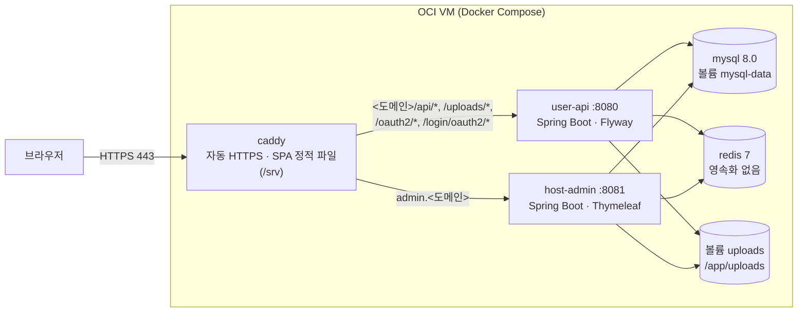

# HoneyRest 단일 서버 배포 가이드 (Oracle Cloud Always Free + Docker)

세 저장소(사용자 API · 관리자 앱 · 사용자 SPA)를 **VM 한 대**에 Docker Compose 로 올리는 방법입니다.
도메인 없이 공인 IP 기반 `sslip.io` 이름과 Let's Encrypt HTTPS 를 씁니다.

| 항목 | 값 |
|------|----|
| 서버 | Oracle Cloud Always Free · Ampere A1 (aarch64) · **1 OCPU / 6GB** (최대 4 OCPU / 24GB 까지 무료로 늘릴 수 있음) |
| OS | Ubuntu 26.04 Minimal (aarch64) · 리전: Tokyo |
| 사용자 사이트 | `https://<IP-하이픈>.sslip.io` (예: `https://152-70-12-34.sslip.io`) |
| 관리자 사이트 | `https://admin.<IP-하이픈>.sslip.io` |
| 배포 파일 | 이 저장소의 [`deploy/`](../deploy) |

---

## 1. 구성



- **같은 Origin**: SPA 와 API 가 `https://<도메인>` 하나에 있습니다. SPA 는 `VITE_BACKEND_URL` 을 비운 채 빌드되어 `/api/...` 상대 경로로 요청하고 Caddy 가 `user-api` 로 넘깁니다 → CORS·SameSite 문제 없음 (리프레시 토큰 쿠키 `Secure; HttpOnly; SameSite=Strict`).
- **SPA 라우팅**: 파일이 없는 경로(`/reserve`, `/user/mypage/...`)는 `index.html` 로 대체(`try_files`). `/login/google/callback` 같은 소셜 콜백도 SPA 라우트입니다.
- **스키마**: `user-api` 가 기동하며 Flyway V1~최신을 적용합니다. `host-admin` 은 `ddl-auto=validate` 라서 `user-api` 가 healthy 가 된 뒤에 뜹니다(`depends_on: service_healthy`).
- **업로드 이미지**: 두 앱이 같은 `uploads` 볼륨을 씁니다. 관리자가 올린 숙소 이미지(`/uploads/...`)가 사용자 사이트에도 같은 경로로 보입니다.
- **포트**: 외부에는 Caddy 의 80/443 만 열립니다. MySQL·Redis·두 앱은 Docker 내부 네트워크에만 있습니다.
- **운영 프로필**: 두 백엔드 모두 `application-prod.properties`(비밀값 없음, 전부 환경변수). 메일·결제·소셜 로그인·날씨 키가 없어도 **기동은 성공**하고 그 기능만 동작하지 않습니다.

메모리 예산(6GB 기준, `deploy/.env` 에서 조정): MySQL 768MB · Redis 160MB · user-api 1GB · host-admin 900MB · Caddy 192MB ≈ 3GB.
실측(시드 후 유휴): 약 1.1GB. 나머지는 OS·이미지 빌드용이며, `setup.sh` 가 4GB 스왑을 추가합니다.

### 배포 파일

| 파일 | 역할 |
|------|------|
| `deploy/docker-compose.yml` | mysql · redis · user-api · host-admin · caddy, 헬스 체크·기동 순서·메모리 상한 |
| `deploy/Caddyfile` | 사용자/관리자 호스트 라우팅, 자동 HTTPS, SPA 대체, 캐시 헤더 |
| `deploy/caddy/Dockerfile` | Node 20 으로 SPA 빌드 → `caddy:2-alpine` 의 `/srv` (`VITE_E2E` 코드가 섞이면 빌드 실패) |
| `deploy/.env.example` | 모든 환경변수 설명 ([필수]/[비밀]/[선택]/[빌드] 표기) |
| `deploy/setup.sh` | 새 VM 설치: 패키지·스왑·방화벽·Docker·클론·`.env` 생성·빌드·기동·시드·cron |
| `deploy/seed.sh` | 초기 데이터 (기초 데이터는 한 번만, 나머지는 반복 실행 안전) |
| `deploy/update.sh` | 백업 → `git pull` → 빌드 → 재기동 → 이미지 정리 |
| `deploy/rollback.sh` | 직전 이미지(`:previous`)로 되돌리기 |
| `deploy/backup.sh` | MySQL 덤프 + uploads → `/opt/honeyrest/backups` (최근 7개) |
| `Dockerfile` (각 백엔드 저장소 루트) | JDK 17 빌드 → JRE 17 실행, 비루트 사용자, arm64 지원 |

---

## 2. 사전 준비 (OCI 콘솔)

1. **인스턴스 생성**: Compute → Instances → Create
   - Image: **Canonical Ubuntu 26.04 Minimal (aarch64)**
   - Shape: **VM.Standard.A1.Flex**, 1 OCPU / 6GB (나중에 4 / 24 까지 늘릴 수 있음)
   - 부트 볼륨 기본값(47GB)으로 충분합니다. SSH 공개 키를 등록합니다.
2. **공인 IP 고정(권장)**: sslip.io 주소가 IP 에서 만들어지므로 IP 가 바뀌면 주소도 바뀝니다.
   인스턴스 → Attached VNICs → IPv4 Addresses → 공인 IP 를 **Reserved public IP** 로 바꿔 둡니다.
3. **인그레스 규칙 (직접 해야 함)**: Networking → Virtual Cloud Networks → (VCN) → Subnet → Security List → **Add Ingress Rules**

   | Source CIDR | IP Protocol | Destination Port |
   |-------------|-------------|------------------|
   | `0.0.0.0/0` | TCP | `80` |
   | `0.0.0.0/0` | TCP | `443` |

   (네트워크 보안 그룹(NSG)을 쓰고 있다면 NSG 에 같은 규칙을 넣습니다.)
   80 은 Let's Encrypt 인증(HTTP-01)과 HTTP→HTTPS 리다이렉트에 필요합니다.
   OS 안의 방화벽(iptables)은 `setup.sh` 가 엽니다.

---

## 3. 설치 (SSH 접속부터 접속 확인까지)

```bash
# 로컬 PC 에서
ssh -i ~/.ssh/<키파일> ubuntu@<공인IP>

# 서버에서
sudo apt-get update && sudo apt-get install -y git
sudo mkdir -p /opt/honeyrest && sudo chown "$USER:$USER" /opt/honeyrest
git clone https://github.com/Seongwonp/honeyRest_user.git /opt/honeyrest/honeyRest_user

sudo /opt/honeyrest/honeyRest_user/deploy/setup.sh
```

`setup.sh` 가 하는 일 (다시 실행해도 안전합니다):

1. 기본 패키지(curl·git·openssl·cron), 시간대 `Asia/Seoul`
2. 스왑 4GB (`SWAP_SIZE=2G` 처럼 바꿀 수 있음), `vm.swappiness=10`
3. OS 방화벽 TCP 80/443 허용 — Oracle 이미지의 `iptables ... REJECT` 앞에 규칙을 넣고 `/etc/iptables/rules.v4` 에도 반영. ufw 가 켜져 있으면 ufw 로 처리
4. Docker Engine + compose/buildx 플러그인 (공식 저장소, arm64)
5. `/opt/honeyrest` 아래에 `honeyRest_host`(서브모듈 포함)·`honeyrest_user_react` 클론
6. `deploy/.env` 생성 — DB·JWT·데모 계정 비밀번호를 `openssl rand` 로 만들고, 공인 IP 로 `SITE_DOMAIN=<IP-하이픈>.sslip.io` 설정 (권한 600)
7. 이미지 빌드(서비스별 순차) → `docker compose up -d` → healthy 대기
   **첫 빌드는 1 OCPU 에서 15~30분** 걸릴 수 있습니다 (Gradle 2회 + npm).
8. `seed.sh` — 숙소 33개·객실 101개·지역·태그·데모 리뷰, 이미지 플레이스홀더
9. cron `/etc/cron.d/honeyrest` — 5분마다 헬스 체크, 매일 04:30 백업

끝나면 주소와 관리자 데모 계정이 출력됩니다.

```
사용자 사이트 : https://152-70-12-34.sslip.io
관리자 사이트 : https://admin.152-70-12-34.sslip.io
  업체 관리자 : contact@honeyrest.com / <DEMO_COMPANY_PASSWORD>
  총관리자   : admin@honeyrest.com / <DEMO_ADMIN_PASSWORD>
```

확인:

```bash
cd /opt/honeyrest/honeyRest_user/deploy
sudo docker compose ps                         # 5개 서비스 Up, user-api/host-admin (healthy)
curl -I https://$(grep ^SITE_DOMAIN= .env | cut -d= -f2)/
```

> 첫 HTTPS 접속 직전에 Caddy 가 인증서를 발급합니다(수십 초). 브라우저에서 인증서 오류가 나면 1분쯤 뒤 다시 열어 보고,
> 계속되면 [문제 해결](#9-문제-해결)의 HTTPS 항목을 봅니다.
> `setup.sh` 직후 `docker` 를 sudo 없이 쓰려면 SSH 에 다시 로그인합니다(docker 그룹 반영).

### 선택 연동 켜기

`deploy/.env` 를 편집한 뒤 반영합니다.

```bash
cd /opt/honeyrest/honeyRest_user/deploy
nano .env
sudo ./update.sh --no-pull        # [빌드] 값(SITE_DOMAIN·TOSS_CLIENT_KEY·소셜 ID·지도 키)이 바뀌었으면 SPA 를 다시 빌드
```

| 기능 | 설정 | 비워 두면 |
|------|------|-----------|
| 결제 | `TOSS_CLIENT_KEY`(`test_gck_...`), `TOSS_SECRET_KEY`(`test_gsk_...`) — 토스페이먼츠 개발자센터의 **테스트** 키 | 결제 승인만 실패 |
| 메일 | `MAIL_USERNAME`(Gmail 주소), `MAIL_PASSWORD`(Google 계정 → 보안 → 2단계 인증 → **앱 비밀번호** 16자리) | 메일 발송 생략(no-op). **회원가입 인증 메일이 가지 않아 일반 가입자가 로그인할 수 없음** → 아래 문제 해결 참고 |
| 카카오 로그인 | `KAKAO_CLIENT_ID`(REST API 키), `KAKAO_CLIENT_SECRET` · 카카오 개발자 콘솔 Redirect URI: `https://<도메인>/login/kakao/callback` | 소셜 로그인만 실패 |
| 구글 로그인 | `GOOGLE_CLIENT_ID`, `GOOGLE_CLIENT_SECRET` · 승인된 리디렉션 URI: `https://<도메인>/login/google/callback` (Google 은 `sslip.io` 같은 공용 접미사 도메인을 허용하지 않을 수 있어 실제 도메인 권장) | 소셜 로그인만 실패 |
| 날씨 | `WEATHER_API_KEY` (OpenWeather) | 날씨 위젯만 실패 |
| 지도 / 공휴일 | `GOOGLE_MAPS_API_KEY`, `GOOGLE_MAP_ID`, `HOLIDAY_API_KEY` | 지도·공휴일 표시만 안 됨 |

데모 계정이 필요 없으면 `HOST_SPRING_PROFILES=prod` 로 바꿉니다. 데모 비밀번호는 계정이 **처음 만들어질 때만** 쓰입니다(이후 `.env` 를 바꿔도 기존 비밀번호 유지).

---

## 4. 로그와 상태

모든 명령은 `/opt/honeyrest/honeyRest_user/deploy` 에서 실행합니다 (docker 그룹이 아니면 앞에 `sudo`).

```bash
docker compose ps                              # 상태·헬스
docker compose logs -f --tail=200 user-api     # 사용자 API (Flyway, 예외)
docker compose logs -f --tail=200 host-admin   # 관리자 앱
docker compose logs -f --tail=100 caddy        # 접속 로그·인증서 발급
docker compose logs --since 1h mysql
docker stats --no-stream                       # 컨테이너별 메모리
free -h && swapon --show                       # 서버 메모리·스왑
journalctl -t honeyrest-health --since today   # cron 헬스 체크 실패 기록
tail -n 50 /var/log/honeyrest-backup.log       # 백업 기록
```

컨테이너 로그는 서비스마다 10MB × 3개로 회전합니다.

재시작: `docker compose restart user-api` · 전체 중지/시작: `docker compose stop` / `docker compose up -d`

> **`docker compose down -v` 는 절대 쓰지 마세요.** `-v` 는 DB(`mysql-data`)·업로드·**인증서(`caddy-data`)** 볼륨까지 지웁니다.
> 인증서를 지우고 재발급을 반복하면 Let's Encrypt 발급 한도에 걸립니다.

DB 콘솔: `docker compose exec mysql sh -c 'mysql -uroot -p"$MYSQL_ROOT_PASSWORD" "$MYSQL_DATABASE"'`

---

## 5. 업데이트

```bash
sudo /opt/honeyrest/honeyRest_user/deploy/update.sh
```

1. `backup.sh` 로 DB·업로드 백업 (실패하면 중단)
2. 세 저장소 `git pull --ff-only`, 관리자 저장소 서브모듈을 고정 커밋으로 맞춤(`submodule update --init --recursive`)
3. `user-api` → `host-admin` → `caddy` 순서로 하나씩 빌드. BuildKit 캐시 덕분에 **바뀌지 않은 서비스는 몇 초 만에 끝나고 이미지도 그대로**입니다
4. 이미지가 바뀐 서비스는 직전 이미지를 `:previous` 로 남김 → `docker compose up -d` 가 바뀐 컨테이너만 다시 만듦 → healthy 대기
5. `Caddyfile` 이 바뀌었으면 caddy 컨테이너만 다시 만듦 (인증서 유지)
6. 이름 없는 이미지 정리(`docker image prune -f`). Gradle/npm 빌드 캐시는 남깁니다

옵션: `--no-pull`(`.env` 만 바꿨을 때) · `--no-backup`

사용자 API 에 새 Flyway 마이그레이션이 있으면 재기동 때 자동 적용됩니다. 마이그레이션은 되돌릴 수 없으므로 1단계 백업을 지우지 마세요.

서버별 조정(예: 메모리 상한을 더 세밀하게)은 추적되지 않는 `deploy/docker-compose.override.yml` 에 두면 스크립트와 `docker compose` 명령 모두에 함께 적용됩니다.

---

## 6. 롤백

### 이미지 롤백 (가장 빠름, 1분 이내)

```bash
sudo /opt/honeyrest/honeyRest_user/deploy/rollback.sh user-api          # 또는 host-admin, caddy (여러 개 가능)
```

`:previous` 이미지를 `:latest` 로 되돌리고 그 컨테이너만 다시 만듭니다(문제 이미지는 `:rolled-back` 으로 보관).
저장소는 새 커밋에 그대로 있으므로, **원인을 고치기 전에는 `update.sh` 를 다시 실행하지 않습니다**(다시 새 코드로 빌드됨).

### 코드 롤백 (특정 커밋으로)

```bash
cd /opt/honeyrest/honeyRest_user && git log --oneline -5
git checkout <정상 커밋>                       # 확인이 끝나면 git checkout main 으로 복귀
sudo ./deploy/update.sh --no-pull
```

### DB 까지 되돌려야 할 때

새 마이그레이션이 이미 적용된 뒤 예전 이미지로 돌아가면 `ddl-auto=validate` 에 실패할 수 있습니다.
그때는 업데이트 직전 백업으로 DB 를 복원한 뒤 이미지 롤백을 합니다 → [백업과 복원](#7-백업과-복원).

---

## 7. 백업과 복원

`setup.sh` 가 매일 04:30(서버 시간 Asia/Seoul) 백업을 cron 에 등록합니다. 직접 등록하려면:

```cron
# /etc/cron.d/honeyrest
30 4 * * * root /opt/honeyrest/honeyRest_user/deploy/backup.sh >> /var/log/honeyrest-backup.log 2>&1
```

- 결과: `/opt/honeyrest/backups/honeyrest_db-YYYYMMDD-HHMMSS.sql.gz`, `uploads-YYYYMMDD-HHMMSS.tar.gz` (각각 최근 7개, `KEEP=14` 로 변경 가능)
- `mysqldump --single-transaction` 이라 서비스 중에도 잠금 없이 일관된 스냅샷입니다
- 회원 정보가 들어 있으므로 권한 600. 서버 밖에도 보관하세요: `scp ubuntu@<IP>:/opt/honeyrest/backups/*.gz ./`

복원:

```bash
cd /opt/honeyrest/honeyRest_user/deploy
sudo docker compose stop user-api host-admin
gunzip -c /opt/honeyrest/backups/honeyrest_db-<시각>.sql.gz | \
  sudo docker compose exec -T mysql sh -c 'MYSQL_PWD="$MYSQL_ROOT_PASSWORD" mysql -uroot "$MYSQL_DATABASE"'
# 업로드 파일까지 되돌릴 때
sudo docker compose start user-api
sudo docker compose exec -T user-api tar -C /app -xzf - < /opt/honeyrest/backups/uploads-<시각>.tar.gz
sudo docker compose up -d
```

---

## 8. 데이터 시드

`setup.sh` 가 처음 한 번 실행합니다. 직접 실행:

```bash
sudo /opt/honeyrest/honeyRest_user/deploy/seed.sh                 # 전체 (기초 데이터는 한 번만)
sudo /opt/honeyrest/honeyRest_user/deploy/seed.sh --demo-refresh  # 데모 데이터만
```

| 순서 | 파일 | 반복 실행 |
|------|------|-----------|
| 1 | 관리자 저장소 `db/seed/insert.sql` → `insert_pk_1-20.sql` → `insert_pk_21-30.sql` → `insert_pk_31-33.sql` (FK 순서: 지역·카테고리·태그·업체 → 숙소·객실) | **한 번만.** 네 파일과 완료 표시(`deploy_seed_history`)를 한 트랜잭션으로 적재. 표시가 있거나 숙소가 이미 있으면 건너뜀 |
| 2 | `scripts/seed-demo-data.sql` — 데모 리뷰 12건, 오늘부터 90일 가격 달력, `min_price`·`rating` 재계산 | 안전 |
| 3 | `scripts/seed-local-images.sql` — 만료된 Firebase 이미지 URL → `/uploads/placeholder/*.svg` | 안전 |
| 4 | `uploads/placeholder/*.svg` → `uploads` 볼륨 | 안전 |
| 5 | Redis 검색 캐시 세대 번호 증가 · 배너 캐시 삭제 | 안전 |
| 6 | `scripts/audit-data-quality.sql` 결과 출력 (`*_mismatch` 가 0 이면 정상) | 읽기 전용 |

가격 달력은 시드 시점부터 90일치입니다(달력이 없는 날짜는 객실 기본가로 계산되므로 예약은 계속 됩니다).
데모 달력을 늘리려면 몇 달에 한 번 `seed.sh --demo-refresh` 를 실행하거나 cron 에 추가합니다.

---

## 9. 문제 해결

### HTTPS 인증서가 발급되지 않음

`docker compose logs caddy | grep -iE 'error|challenge|acme'`

- **80/443 이 막힘**: OCI 보안 목록 인그레스(2장)와 OS 방화벽을 확인합니다.
  ```bash
  sudo iptables -L INPUT -n --line-numbers | head -20   # 80/443 ACCEPT 가 REJECT 보다 위에 있어야 함
  sudo ufw status                                         # ufw 를 쓰는 경우
  ```
  외부에서 확인: 로컬 PC 에서 `curl -I http://<IP-하이픈>.sslip.io` → `308` 이면 80 은 열려 있습니다.
- **Let's Encrypt 발급 한도**: 같은 이름의 인증서는 주 5회, 등록 도메인당 주 50개, 실패한 검증은 시간당 5회로 제한됩니다.
  `sslip.io` 는 많은 사람이 함께 쓰는 도메인이라 한도에 걸릴 가능성이 상대적으로 높습니다.
  - 인증서는 `caddy-data` 볼륨에 있으므로 컨테이너를 다시 만들어도 재발급하지 않습니다. 볼륨을 지우지 마세요.
  - Caddy 는 실패하면 간격을 늘려 가며 자동 재시도합니다. 한도에 걸렸다면 기다리거나 실제 도메인으로 바꿉니다.
  - 설정을 실험할 때는 `Caddyfile` 전역 블록에 `acme_ca https://acme-staging-v02.api.letsencrypt.org/directory` 를 잠시 넣어 스테이징 CA 로 확인합니다(브라우저 경고는 정상). 끝나면 지우고 `docker compose up -d --force-recreate caddy`.
- **IP 가 바뀜**: `.env` 의 `SITE_DOMAIN` 을 새 IP 로 고친 뒤 `sudo ./update.sh --no-pull` (SPA 의 관리자 링크·OAuth 주소가 빌드 시점에 들어가므로 다시 빌드 필요).

### 메모리 부족 (OOM)

- 증상: 컨테이너가 반복 재시작(`docker compose ps` 의 `Restarting`), `docker inspect <컨테이너> --format '{{.State.OOMKilled}}'` 가 `true`, `dmesg | grep -i oom`.
- JVM 은 `-XX:+ExitOnOutOfMemoryError` 로 바로 종료되고 `restart: unless-stopped` 로 다시 뜹니다.
- 조치: `.env` 의 `USER_API_MEM_LIMIT`·`HOST_ADMIN_MEM_LIMIT` 을 올리거나(힙은 상한의 70%), 빌드 중이라면 스왑을 확인합니다(`swapon --show`).
- 빌드가 느리거나 멈춘 것처럼 보이면 대개 스왑을 쓰는 중입니다. 서비스를 잠시 멈추고 빌드하면 빨라집니다: `docker compose stop host-admin && sudo ./update.sh`.
- 인스턴스를 4 OCPU / 24GB 로 늘렸다면: `MYSQL_INNODB_BUFFER_POOL_SIZE=1G`, `MYSQL_MEM_LIMIT=2g`, `USER_API_MEM_LIMIT=2g`, `HOST_ADMIN_MEM_LIMIT=1536m` 정도로 올리고 `docker compose up -d`.

### user-api 가 healthy 가 되지 않음

- `docker compose logs user-api | grep -iE 'flyway|error|caused'` — 마이그레이션 실패, DB 비밀번호 불일치 등.
- `.env` 의 `MYSQL_PASSWORD` 를 MySQL 볼륨이 만들어진 **뒤에** 바꿨다면 DB 계정 비밀번호는 그대로입니다. 원래 값으로 돌리거나 MySQL 에서 `ALTER USER` 합니다.
- 첫 기동은 1 OCPU 에서 1~3분 걸립니다(헬스 체크 유예 240초).

### host-admin 이 기동하지 않음 (`Schema-validation` 오류)

관리자 앱은 스키마를 만들지 않고 검증만 합니다. 관리자 저장소의 서브모듈(공유 도메인 모듈)이 사용자 API 의 마이그레이션보다 앞선 엔티티를 담고 있으면 실패합니다.
사용자 API 를 먼저 최신으로 올리고, 관리자 저장소의 서브모듈 고정 커밋이 맞는지 확인합니다(`git -C /opt/honeyrest/honeyRest_host submodule status`).

### 메일 없이 가입한 계정이 로그인되지 않음

메일 설정(`MAIL_*`)이 비어 있으면 가입 인증 메일이 발송되지 않습니다(로그에 `[mail-disabled]`). 데모 목적으로 직접 인증 처리하려면:

```bash
sudo docker compose exec mysql sh -c 'mysql -uroot -p"$MYSQL_ROOT_PASSWORD" "$MYSQL_DATABASE" \
  -e "UPDATE user SET is_verified = 1 WHERE email = '\''가입한@이메일'\''"'
```

공개 데모라면 Gmail 앱 비밀번호를 설정하는 것을 권장합니다.

### 방화벽 규칙이 재부팅 후 사라짐

`setup.sh` 는 실행 중인 규칙과 `/etc/iptables/rules.v4` 를 함께 고칩니다. `netfilter-persistent save` 는 Docker 가 만든 규칙까지 저장하므로 쓰지 않습니다.
확인: `grep -E 'dport (80|443)' /etc/iptables/rules.v4`

### 디스크가 부족함

```bash
df -h /
docker system df
docker builder prune -f --filter until=168h    # 1주 넘은 빌드 캐시 (다음 빌드가 느려질 수 있음)
docker image rm honeyrest/user-api:rolled-back # 롤백 후 남은 이미지
```

---

## 10. Always Free 유휴 인스턴스 회수

Oracle 은 Always Free 인스턴스가 **7일 동안** 다음을 모두 만족하면 유휴로 보고 회수(중지)할 수 있습니다:
CPU 사용률 95번째 백분위 20% 미만 · 네트워크 사용률 20% 미만 · 메모리 사용률 20% 미만(A1 셰이프).

- 이 스택은 유휴 상태에서도 약 1.1GB(6GB 의 약 18%)를 쓰고 JVM 힙이 커지면서 더 늘어납니다. 메모리 기준에 걸릴 가능성은 낮지만 장담할 수는 없습니다.
- `setup.sh` 의 cron 헬스 체크(5분마다 공개 주소로 API·관리자 앱 호출)는 장애를 기록하고 서비스를 깨워 두는 가벼운 핑입니다. **CPU 를 일부러 소모하지는 않으므로 회수 기준 자체를 막지는 않습니다.**
- 확실히 피하려면 계정을 **Pay As You Go 로 업그레이드**합니다. Always Free 한도 안의 리소스는 계속 무료이며 유휴 회수 대상에서 빠집니다.
- 회수되어 중지되었다면 콘솔에서 인스턴스를 시작하면 됩니다. 모든 컨테이너는 `restart: unless-stopped` 라 Docker 와 함께 자동으로 다시 뜹니다(예약 공인 IP 를 쓰면 주소도 그대로).

---

## 11. 도메인을 산 뒤

1. DNS A 레코드 2개: `@` → 서버 IP, `admin` → 서버 IP
2. `.env`: `SITE_DOMAIN=example.com`
3. `sudo ./update.sh --no-pull` — SPA 다시 빌드, Caddy 가 새 이름으로 인증서 발급
4. 카카오/구글 콘솔의 Redirect URI 를 새 주소로 바꿉니다.

---

## 12. 보안 메모

- `deploy/.env` 에 모든 비밀값이 있습니다(권한 600, git 제외). 서버 밖에 안전하게 따로 보관하세요.
- 비밀값 파일(`application_security.properties`)·Firebase 키는 `.dockerignore` 로 이미지에 들어가지 않습니다.
- 토스는 **테스트 키만** 쓰세요. 라이브 키를 넣으면 실제 결제가 일어납니다.
- 관리자 사이트는 공개 주소에 있습니다. 데모 계정 비밀번호는 `setup.sh` 가 무작위로 만든 값을 쓰고, 외부에 공개할 때는 업체 관리자 계정만 알려 주세요.
- SSH 는 키 인증만 쓰고, MySQL/Redis 포트는 외부에 열지 않습니다(compose 에 `ports` 없음).
